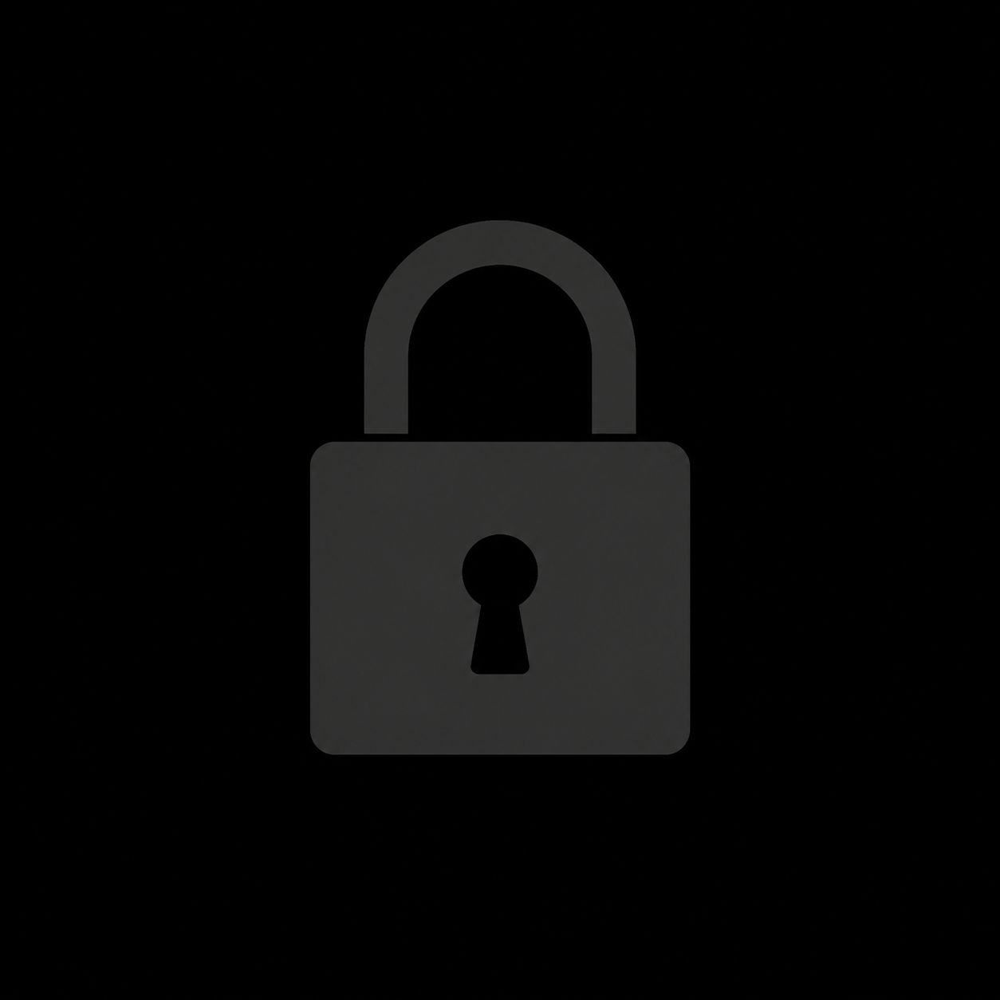

<p align="center">
	
</p>

<h1 align="center">LOCKED</h1>

<p align="center">
	<a href="https://github.com/">
		
	</a>
	<a href="https://www.android.com/">
		
	</a>
</p>

<p align="center"><em>Personal focus and discipline</em></p>

> **WARNING**  
> Locked can place a full-screen blocking screen over selected apps and keep protection running in the background. It is intentionally difficult to bypass: once an app is opened, continuing requires an uninterrupted 20-second hold and confirmation. Review the permissions below before using it as a daily discipline tool.

Locked interrupts selected distractions with a slow motivational sequence, then asks for a deliberate 20-second hold before allowing that opening. It also includes an optional once-a-day morning self-hypnosis session using Android TextToSpeech.

## What It Protects

Version 1 protects:

- Instagram
- TikTok, including its alternate regional package
- Brave Browser

The protected package list is currently defined in `app/src/main/kotlin/com/locked/app/data/ProtectedApps.kt`.

## Required Access

Locked needs these Android settings to function as designed:

| Access | Why it is needed |
| --- | --- |
| **Accessibility access** | Detects when Instagram, TikTok, or Brave comes to the foreground. Locked checks the foreground app identity; it does not read on-screen content. |
| **Display over other apps** | Places the block screen above the app that was opened, immediately. |
| **Notifications** | Shows the ongoing protection notification and optional motivational reminders. |
| **Background activity** | The foreground service keeps protection alive, listens for the morning-session trigger, and receives the boot event after restart. |
| **Wake lock** | Keeps the device awake while the exact 20-second hold is in progress. |

On Samsung devices, open **Settings > Apps > Locked > Battery** and choose **Unrestricted** if the phone stops protection while Locked is in the background. Android may also show a system confirmation when Accessibility access or overlay access is granted.

## First Run

1. Install and open Locked.
2. Grant **Accessibility access** and enable Locked in the downloaded-apps or installed-services list.
3. Grant **Display over other apps**.
4. Allow **Notifications** when Android requests them.
5. Return to Locked and start protection.
6. Optionally configure the morning session and add a royalty-free ambient track.

## Try the Published APK

The installable v1.0 artifact is in [`publish/locked-v1.0.apk`](publish/locked-v1.0.apk). It is a debug-signed trial build with package ID `com.locked.app.trial`, so it can be installed alongside another Locked package.

If Android reports **App not installed** when opening the downloaded file, use the source build below. It gives Android's installer a clearer error and avoids browser download or package-conflict issues.

## Build From Source

### Requirements

- Android Studio
- Android SDK Platform 35
- JDK 17
- A USB-debuggable Android device or an Android emulator

Open this folder in Android Studio and sync the Gradle project. If the Gradle wrapper scripts are present, build with:

```bash
./gradlew :app:assembleDebug
```

On Windows:

```powershell
.\gradlew.bat :app:assembleDebug
```

The APK is written to `app/build/outputs/apk/debug/`.

To install directly over USB, replace the serial with the value shown by `adb devices`:

```bash
adb devices
adb install -r app/build/outputs/apk/debug/app-debug.apk
```

If the wrapper scripts are not included in your checkout, run the build from Android Studio or generate them once with an installed Gradle distribution:

```bash
gradle wrapper
```

## Morning Audio

Place a royalty-free file at `app/src/main/assets/morning_ambient.mp3`. The morning session works without it, but will have no background music.

## Project Shape

- `service/` detects protected apps and keeps protection alive.
- `ui/block/` contains the motivational sequence, hold timer, and confirmation.
- `ui/morning/` contains the optional morning session.
- `data/` contains settings, scripts, messages, and protected package names.

## License

Released under the [MIT License](LICENSE).
